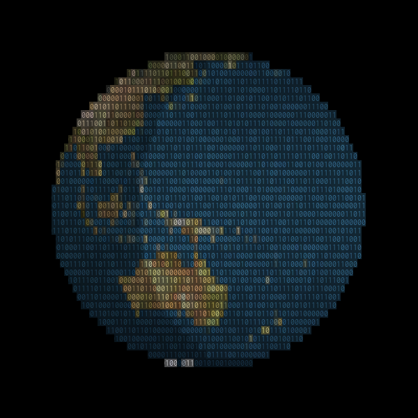

# ASCII Renderer

[*View the demo here*][ascii-demo]

[][ascii-demo]

Renders a [THREE.js] renderer with a mask on top created from an SVG.

By using an SVG that doesn't update at runtime frame rate is drastically
improved over alternative methods such as [the ascii effect
example][ascii-effect-eg] (which this was originally inspired by). The
limitation is that the text or the viewport size can't change often.

## How to use

Grab `ascii-renderer.js` or the minified version and set it up according to the
example in `index.html`. There are code docs in the js.

```js
var renderer = new THREE.WebGLRenderer();
// This step is important, the renderer must have a parent
container.appendChild(renderer.domElement);

var asciiRenderer = new AsciiRenderer(renderer, {
    charSet: '010011',
    opacity: 0.7,
});
```

## Development

You can set up a dev server with `npm run start` and minify with `npm run start`.

## TODO: list

1. Toon lighting has issues when viewed from behind. Try a custom lighting model.
1. Fix font size rendering so that any combination of font and canvas size can be used.
1. Add font ratio detection so that any monospace font can be used.
1. Check out Firefox orbitControls bug.

[ascii-demo]: https://deovolentegames.github.io/ascii-renderer/
[three.js]: https://github.com/mrdoob/three.js
[ascii-effect-eg]: https://threejs.org/examples/?q=ascii#canvas_ascii_effect
